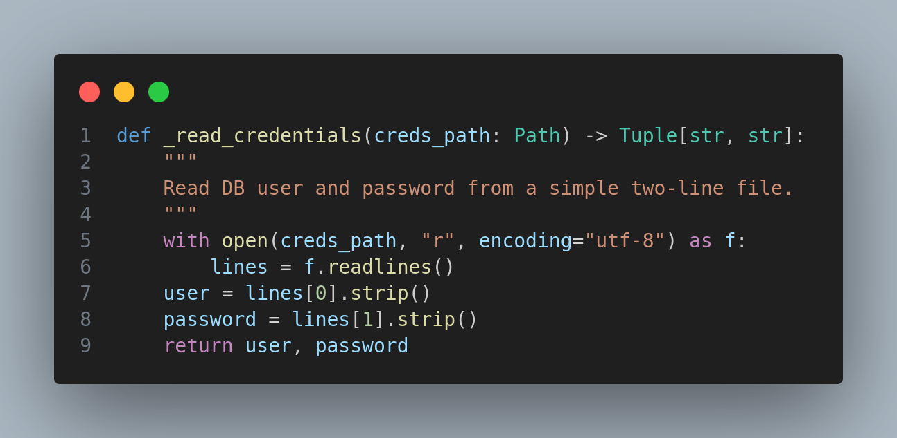
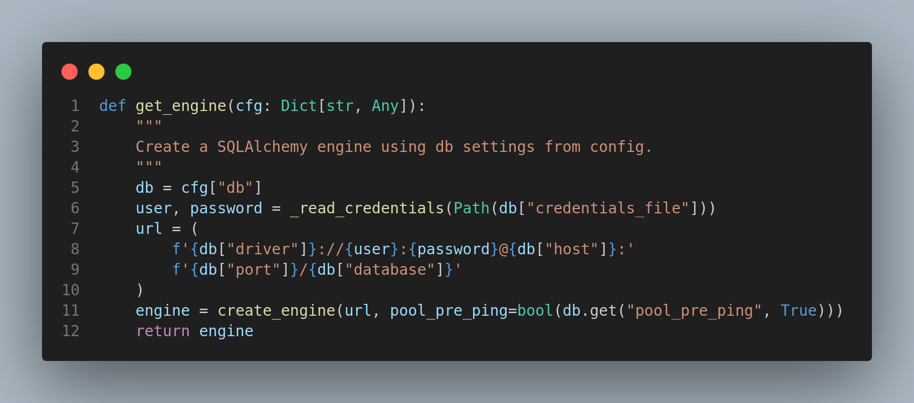
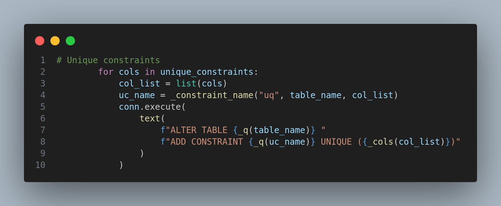

# Trussels- og sårbarhedsanalyse for ETL-databasen

**Udarbejdet af:** Delta Thiesen \<delta.thiesen.1990@gmail.com\><br>
**Dato:** 7. november 2025<br>
**Projekt:** week6_etl<br>
**Kilde:** https://github.com/whelixw/week6_etl<br>
**Analyseområde:** Database og tilhørende ETL-komponenter<br>

## 1. Indholdsfortegnelse

- [Trussels- og sårbarhedsanalyse for ETL-databasen](#trussels--og-sårbarhedsanalyse-for-etl-databasen)
  - [1. Indholdsfortegnelse](#1-indholdsfortegnelse)
  - [2. Formål og omfang](#2-formål-og-omfang)
  - [3. Systemoversigt](#3-systemoversigt)
  - [4. Trusselsbillede](#4-trusselsbillede)
  - [5. Sårbarhedsanalyse](#5-sårbarhedsanalyse)
    - [5.1 Bruger- og adgangsstyring](#51-bruger--og-adgangsstyring)
    - [5.2 SQL-Injection](#52-sql-injection)
    - [5.3 Datalæk og fortrolighed](#53-datalæk-og-fortrolighed)
    - [5.4 Logning og audit](#54-logning-og-audit)
    - [5.5 Konfigurations- og afhængighedssikkerhed](#55-konfigurations--og-afhængighedssikkerhed)
  - [6. Risikooversigt](#6-risikooversigt)
  - [7. Samlet vurdering](#7-samlet-vurdering)
  - [7. Anbefalede forbedringer](#7-anbefalede-forbedringer)
  - [9. Konklusion](#9-konklusion)

## 2. Formål og omfang

Formålet med denne analyse er at identificere, vurdere og prioritere trusler og sårbarheder, som påvirker **ETL-databasen** i projektet `week6_etl`.

Fokus ligger på:

- Bruger- og adgangsstyring
- Risiko for datalæk
- SQL-injection og input-sårbarheder
- Logning og sporbarhed

## 3. Systemoversigt

Projektet består af:

- Python-scripts, der læser data fra CSV-filer
- En MySQL-database, som opdateres gennem SQLAlchemy eller direkte queries
- En konfigurationsfil (`config.yaml`) og en credential-fil (`db_credentials.txt`)

Databasen anvendes som **mål for ETL-processen** — dvs. den modtager og opdaterer data, men håndterer ikke slutbrugere direkte. Sikkerheden afhænger derfor primært af, hvordan forbindelsen etableres, og hvordan input behandles.

## 4. Trusselsbillede

|Trusselstype|Beskrivelse|Potentiel aktør|Formål|
| :- | :- | :- | :- |
|**Uautoriseret adgang**|Angriber får fat i database-login via lokal fil eller historik|Intern/ekstern|Datatyveri, ændring eller sletning|
|**SQL-Injection**|Uvaliderede input fra ETL-laget manipulerer queries|Udviklerfejl eller ondsindet input|Datamanipulation, eksfiltration|
|**Datalæk**|Klartekst-credentials, ukrypteret forbindelse, eller læk via logs|Utilsigtet fejl, konfigurationsfejl|Fortrolighedsbrud|
|**Manglende logning / audit**|Manglende sporbarhed ved fejl eller misbrug|Intern fejl eller manipulation|Manglende detektion og efterforskning|
|**Afhængighedssårbarheder**|Biblioteker som `pymysql`, `sqlalchemy` kan have CVE’er|Ekstern angriber|Kompromittering af databaseforbindelse|

## 5. Sårbarhedsanalyse

### 5.1 Bruger- og adgangsstyring

|||
| :-: | :-: |

**Observation:**

- Projektet gemmer database-login i klartekst i filen `db_credentials.txt`.
- Der anvendes ingen central autentificering eller tokens.

**Risiko:**

- Filen kan lækkes via Git, filsystem eller backup.
- Adgangskoden kan genbruges i andre systemer.
- Ingen adskillelse af rettigheder mellem læse- og skriveoperationer.

**Anbefalinger:**

- Fjern `db_credentials.txt` fra repository.
- Roter alle credentials.
- Overvej brug af miljøvariabler eller en secrets-manager.
- Aktivér flerfaktor-autentificering for databaseadministratorer.

### 5.2 SQL-Injection

||
| :-: |

**Observation:**

- Projektet bruger SQLAlchemy, men hvis der indsættes dynamiske SQL-strenge (f.eks. f-strings eller string-concatenation), kan det give risiko for SQL-injection.
- Der er ingen input-sanitering i den del af koden, der indlæser CSV-data.

**Risiko:**

- Uautoriseret manipulation af databasen.
- Udsivning af data gennem fejllogning eller output.

**Anbefalinger:**

- Brug **parameteriserede queries** udelukkende.
- Brug SQLAlchemy ORM i stedet for rå SQL-strenge.
- Implementér inputvalidering for hver CSV-kolonne (datatype, længde, format).
- Log og afvis uventede værdier i data.

**Eksempel (sikkert query):**
```py
stmt = text("INSERT INTO users (id, name) VALUES (:id, :name)")
engine.execute(stmt, {"id": user_id, "name": user_name})
```

### 5.3 Datalæk og fortrolighed

||
| :-: |

**Observation:**

- Der er ingen kryptering af forbindelsen mellem ETL-komponenten og MySQL, og credentials ligger i klartekst.
- Der anvendes heller ingen kryptering ved lagring af data.

**Risiko:**

- Afluring af brugernavn/password over netværket.
- Utilsigtet eksponering af følsomme data i CSV eller logfiler.

**Anbefalinger:**

- Aktivér TLS/SSL på MySQL-serveren (`require_secure_transport = ON`).
- Brug `ssl_ca` i forbindelses-strengen.
- Krypter backup-filer og arkiverede CSV’er (AES-256 eller lignende).
- Maskér persondata i logfiler og rapporter.

### 5.4 Logning og audit

**Observation:**

- Projektet logger ikke autentificerings- eller transaktionshændelser.
- Fejl printes lokalt uden central registrering.

**Risiko:**

- Manglende sporbarhed ved fejl eller sikkerhedshændelser.
- Vanskeligt at identificere manipulation eller uautoriseret adgang.

**Anbefalinger:**

- Implementér **audit-log** i databasen (f.eks. triggers eller separate logtabeller).
- Brug Python’s `logging`-modul med rotation og timestamp.
- Log indlæste filnavne, antal poster og kørselstid.
- Maskér credentials og følsomme værdier i logs.

### 5.5 Konfigurations- og afhængighedssikkerhed

**Observation:**

- Der er ingen CI-pipeline til sikkerhedsscanning.
- Afhængigheder som **sqlalchemy** og **pymysql** kan indeholde sårbarheder over tid.

**Risiko:**

- Kendte CVE’er kan udnyttes, hvis projektet ikke holdes opdateret.

**Anbefalinger:**

- Implementér `pip-audit` og `bandit` i GitHub Actions.
- Opdater `requirements.txt` jævnligt.
- Brug virtuelle miljøer og versions-pinning (`==`).

## 6. Risikooversigt

|Sårbarhed|Konsekvens|Sandsynlighed|Niveau|
| :- | :- | :-: | :-: |
|Klartekst credentials|Fuldt DB-kompromis|Høj|Kritisk|
|SQL-injection|Manipulation, datatyveri|Middel|Høj|
|Ukrypteret DB-forbindelse|Læk af data og login|Middel|Høj|
|Manglende audit-logning|Ingen sporbarhed|Middel|Medium|
|Sårbare afhængigheder|Potentiel udnyttelse|Lav|Lav|

## 7. Samlet vurdering

Databasen i week6_etl er funktionel, men **ikke sikkerhedshærdet**.

De væsentligste trusler er relateret til **credentials i klartekst**, **manglende kryptering** og **potentiel SQL-injection** gennem ukontrolleret input.

Ved at implementere anbefalingerne kan projektet bringes op til en acceptabel sikkerhedsstandard for interne eller uddannelsesmæssige systemer.

## 7. Anbefalede forbedringer

|Nr.|Tiltag|Beskrivelse|Prioritet|
| :-: | :- | :- | :-: |
|1|Fjern credentials fra repo og roter adgang|Erstat med miljøvariabler / secret manager|Kritisk|
|2|Aktivér SSL/TLS på DB-forbindelse|Krypter transportlaget|Kritisk|
|3|Implementér inputvalidering og parameteriserede queries|Forebyg SQL-injection|Høj|
|4|Tilføj audit-log og central logning|Sporbarhed og kontrol|Medium|
|5|Kør pip-audit og bandit i CI|Forebyg afhængighedsrisici|Medium|

## 9. Konklusion

Den nuværende ETL-database er sårbar over for flere almindelige trusler: **credential-kompromittering**, **datalæk** og **SQL-injection**.

Projektet bør straks implementere sikre metoder til **godkendelse**, **kommunikation** og **logging**, hvorefter risikoen reduceres markant.

Efter udbedring forventes risikoen at falde fra *kritisk* til *lav-medium*.