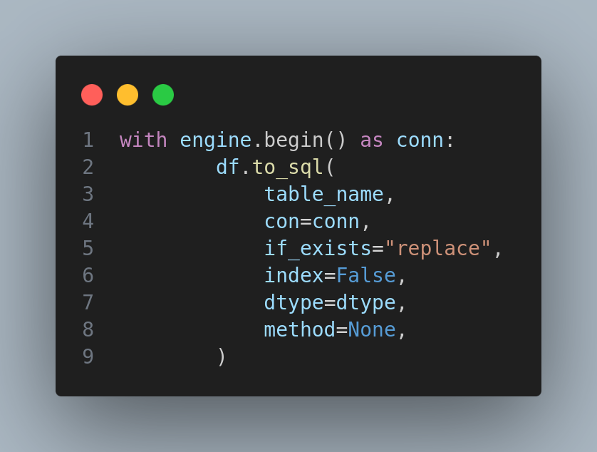
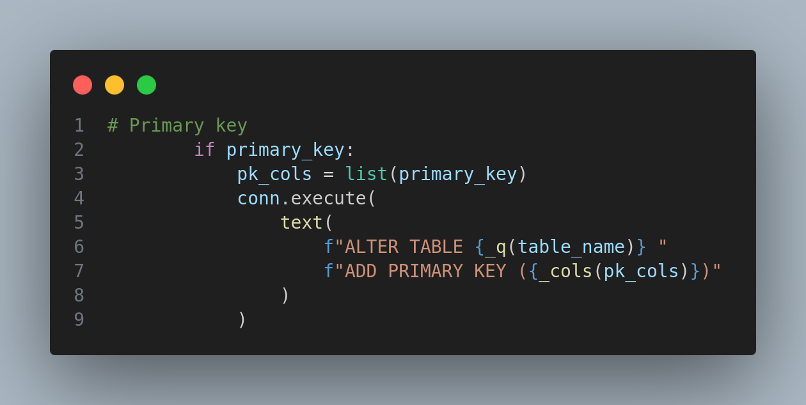
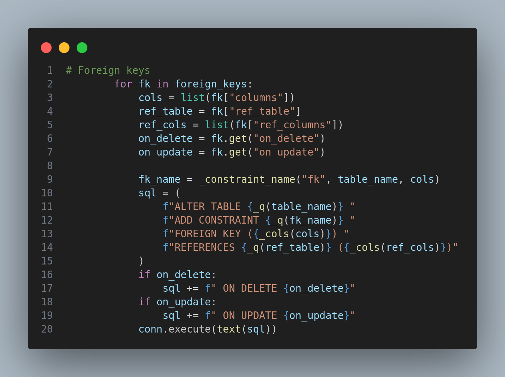
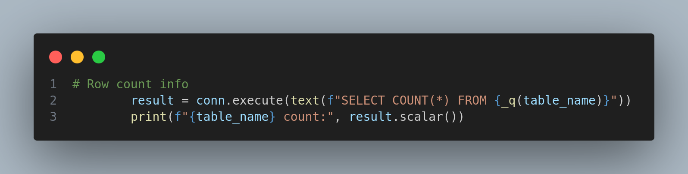

# load_to_sql()

**Fil:** [utils.py]() 
**Linjer:** 160-234 

---

**Risiko:**

- Tabellen overskrives (`if_exists="replace"`) uden bekræftelse

**Konsekvens:**

- Tab af data / manglende transaktionskontrol

---

**Risiko:**

- Indsættes af dynamiske SQL-strenge (f.eks. f-strings eller string-concatenation), kan det give risiko for SQL-injection

**Konsekvens:**

- SQL-injection

---

**Risiko:**

- Indsættes af dynamiske SQL-strenge (f.eks. f-strings eller string-concatenation), kan det give risiko for SQL-injection

**Konsekvens:**

- Primærnøgle-definitioner gennem fejlmeddelelser

---

**Risiko:**

- Indsættes af dynamiske SQL-strenge (f.eks. f-strings eller string-concatenation), kan det give risiko for SQL-injection
- `on_delete` og `on_update` er direkte tekst, der kan indeholde vilkårlige SQL-kommandostrukturer

**Konsekvens:**

- SQL-injection via fremmednøgle-definitioner

---

**Risiko:**

- Indsættes af dynamiske SQL-strenge (f.eks. f-strings eller string-concatenation), kan det give risiko for SQL-injection
- Output (antal rækker) udskrives direkte til konsollen uden logkontrol

**Konsekvens:**

- Informationslækage / skemadetaljer